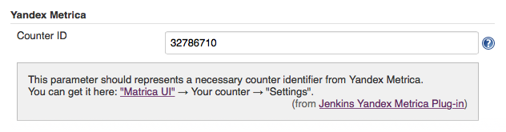

Jenkins Yandex Metrica Plugin
=============================

Yandex Metrica plugin allows to decorate all Jenkins pages with [Yandex.Metrica](https://metrica.yandex.com) tracking code.
It helps you get descriptive reports and record the actions of individual users, find out what they are searching
for on the build system, and how do they use it.


Requirements
------------

* Jenkins LTS 1.580.1 or higher
* Java SE Runtime Environment 1.7 or higher
* Yandex Metrica account and counter


Configuration
-------------

Configuration section for this plugin is very simple:



You should specify only "Counter ID" parameter to integrate Jenkins with Yandex Metrica.


Development
-----------

How to build the `hpi` file:

1. Clone the git repository:
    ```sh
    $ git clone https://github.com/vbauer/yandex-metrica-plugin
    ```
    
2. Change directory to the `"yandex-metrica-plugin"` repository:
    ```sh
    $ cd yandex-metrica-plugin
    ```
    
3. Build the hpi file:
    ```sh
    $ mvn clean package
    ```
    
4. The hpi file is located at `"target/yandex-metrica.hpi"`.


License
-------

Yandex Metrica plugin is licensed under the MIT license. See [LICENSE](LICENSE.md) file for more information.
